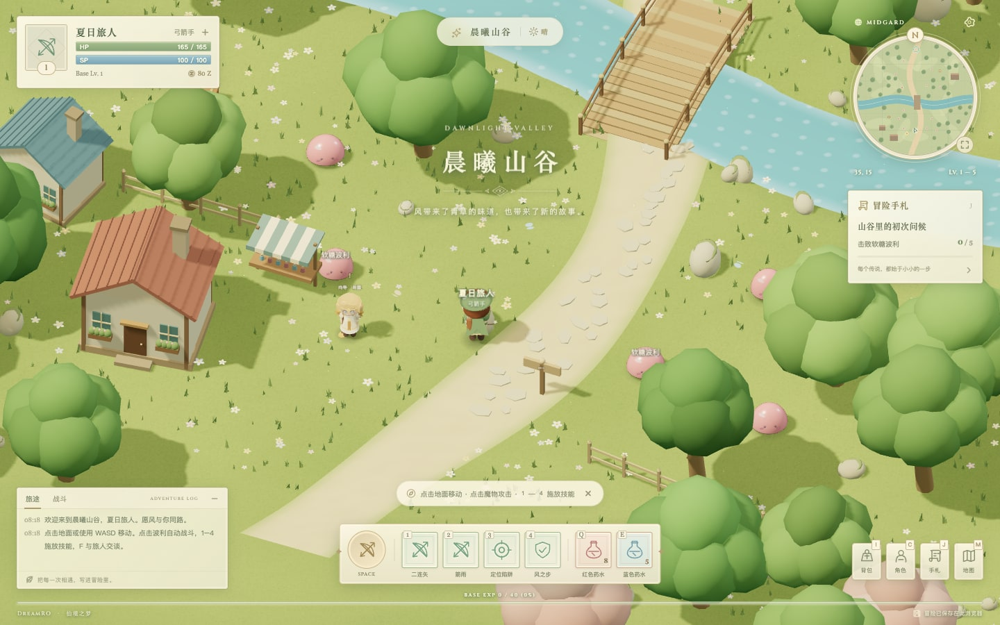

<p align="center"></p>

<h1 align="center">DreamRO</h1>

<p align="center">
  <strong>仙境之梦，一段可以在浏览器里重逢的冒险</strong><br>
  创建角色 · 探索山谷 · 挑战女王 · 收藏旅途
</p>

<p align="center">
  <a href="https://github.com/nocoo/dreamro/actions/workflows/ci.yml"></a>
  
  
  
  
  
  <a href="LICENSE"></a>
</p>

<p align="center">
  <a href="https://dreamro.hexly.ai"></a>
</p>

---

## 这是什么

DreamRO（仙境之梦）是一款致敬经典 RO 的单人网页 RPG。选择一个职业，走过晨曦山谷、萤语森林与星落遗迹，与波利战斗，完成三章故事。

角色、装备、三维场景、动画与音效主要由代码生成，搭配原创幻想插画和经典窗口式界面。进度保存在当前浏览器，随时可以回来接着玩。

线上：[dreamro.hexly.ai](https://dreamro.hexly.ai)

## 功能

- **20 种职业** — 初心者、六大基础职业系与十三种进阶职业；80 个技能配置，支持近战、远程、魔法、治疗、护盾、冲刺、持续伤害与召唤。
- **三章冒险** — 三张相连的 3D 地图，包含村落、溪流、桥梁、森林与女王竞技场；完成向导任务，获得永久波利伙伴。
- **成长与收集** — 战斗升级、自动拾取、药水商店、宝箱、生命卡片和武器强化；倒地后可回到入口继续旅程。
- **自然动画** — 角色呼吸、眨眼、行走、挥武器和施法；波利弹跳、受击与消散，配合法阵、粒子、水流和萤火。
- **经典界面** — 小地图、状态栏、技能快捷栏、背包、角色属性、任务手札，以及可以点击寻路的大地图。
- **桌面与触屏** — 键鼠操作、触屏摇杆、可旋转缩放的镜头、两档画质、原创程序化音乐与音效。

## 安装

无需安装，使用支持 WebGL 2 的现代浏览器打开[游戏](https://dreamro.hexly.ai)。输入名字、选择职业、调整发色和发型，点击「启程，去冒险」。所有职业都可以直接创建。

存档按浏览器和访问地址分别保存。再次打开游戏时，从「继续旅途」选择角色；更换设备或清理站点数据前，请留意本地存档不会自动同步。

## 操作一览

| 操作 | 按键或手势 |
| --- | --- |
| 行走 | `WASD` / 方向键 / 触屏摇杆 |
| 自动寻路 | 点击地面，或在大地图中点击目的地 |
| 选择魔物并自动攻击 | 点击魔物 / `Space` / 触屏攻击按钮 |
| 职业技能 | `1`–`4` / 点击技能栏 |
| 红色药水 / 蓝色药水 | `Q` / `E` |
| 交谈、打开宝箱 | 靠近后按 `F` / 点击交互提示 |
| 切换目标 | `Tab` |
| 旋转、缩放、重置镜头 | 鼠标右键拖动 / 滚轮 / `R` |
| 背包、角色、手札、地图 | `I` / `C` / `J` / `M` |
| 设置、关闭窗口 | `Esc` |

打开窗口时战斗会暂停。离开战斗后会逐渐恢复生命和 SP，升级会完全恢复。女王施法时，走出地面的预警光圈可以躲避冲击。

## 项目结构

```text
.github/workflows/
  ci.yml                  # 浏览器测试、类型检查、构建与打包
  release.yml             # CI 通过后部署、标签发布与版本核验
src/
  data/jobs.ts            # 20 种职业与 80 个技能配置
  game/
    Character.ts          # 角色、装备、波利与动画
    World.ts              # 三张地图、地形和碰撞
    Game.ts               # 战斗、怪物、任务与移动
    Effects.ts            # 法阵、粒子与技能特效
    pathfinding.ts        # A* 寻路
    state.ts              # 成长数值与本地存档
    Audio.ts              # Web Audio 音乐与音效
  ui/HUD.ts               # 游戏窗口、小地图与触屏操作
  main.ts                 # 角色创建与应用生命周期
public/                   # 本地插画、字体与缓存配置
scripts/                  # 构建版本记录与发布核验
tests/                    # 冒险流程、职业、Boss 与渲染回归
docs/                     # 玩法与部署说明
wrangler.jsonc            # Cloudflare Workers 静态资源和域名
```

## 技术栈

| 层 | 技术 |
| --- | --- |
| 语言 | [TypeScript](https://www.typescriptlang.org/) |
| 三维渲染 | [Three.js](https://threejs.org/) / WebGL 2 |
| 构建 | [Vite](https://vite.dev/) |
| 音频与存档 | [Web Audio](https://developer.mozilla.org/en-US/docs/Web/API/Web_Audio_API) / [localStorage](https://developer.mozilla.org/en-US/docs/Web/API/Window/localStorage) |
| 浏览器验证 | [Playwright](https://playwright.dev/) |
| 发布 | [GitHub Actions](https://docs.github.com/en/actions) / [Cloudflare Workers Static Assets](https://developers.cloudflare.com/workers/static-assets/) |

## 开发

需要 Node.js 22.12 或更新版本，以及支持 WebGL 2 的浏览器。

```sh
git clone https://github.com/nocoo/dreamro.git
cd dreamro
npm ci
npm run dev
```

打开终端显示的地址。Vite 默认使用 `5173`，端口被占用时会自动选择下一个；也可以使用 `npm run dev -- --port 5174`。

| 命令 | 说明 |
| --- | --- |
| `npm run dev` | 启动 Vite 开发服务 |
| `npm run typecheck` | TypeScript 类型检查 |
| `npm test` | 运行全部浏览器测试 |
| `npm run build` | 类型检查、生产构建与版本记录 |
| `npm run preview` | 预览生产构建 |
| `npm run deploy:check` | 构建并执行 Wrangler 发布演练 |
| `npm run preview:worker` | 使用本地 Workers 运行时预览，端口 `8787` |
| `npm run verify:release` | 检查线上提交、版本、资源与 SPA 路由 |

正式发布通过 [Release workflow](https://github.com/nocoo/dreamro/actions/workflows/release.yml) 完成：`main` 的 CI 通过后自动发布，标签和手动发布会先重新执行检查。部署配置见[部署文档](docs/deployment.md)。

## 测试

| 层 | 内容 | 触发时机 |
| --- | --- | --- |
| 冒险与职业 | 角色创建、20 职业 / 80 技能、三章通关、地图切换、存档、复活和触屏 | `npm test` / CI |
| Boss 回归 | 近战与远程追击、返回领地、持续伤害、女王击败、竞技场高度关系 | `npm test` / CI |
| 构建与发布 | 类型检查、Worker 打包、提交和版本匹配、线上资源与 SPA 路由 | CI / Release |

```sh
npx playwright install chromium
npm test
npm run build
```

浏览器测试使用独立的 `5188` 端口和隔离的存档。失败时会保存截图和 trace；GitHub Actions 会保留这些产物供排查。Linux CI 使用 Chromium 软件渲染与流畅画质。

## 文档

| 文档 | 内容 |
| --- | --- |
| [玩法说明](docs/gameplay.md) | 职业、任务、女王战、成长与存档 |
| [部署说明](docs/deployment.md) | Cloudflare 配置、GitHub Secrets、CI/CD 与版本发布 |
| [素材与参考](CREDITS.md) | 原创素材、设计参考和字体授权 |
| [更新记录](CHANGELOG.md) | 已发布版本 |

## License

[MIT](LICENSE) © 2026
